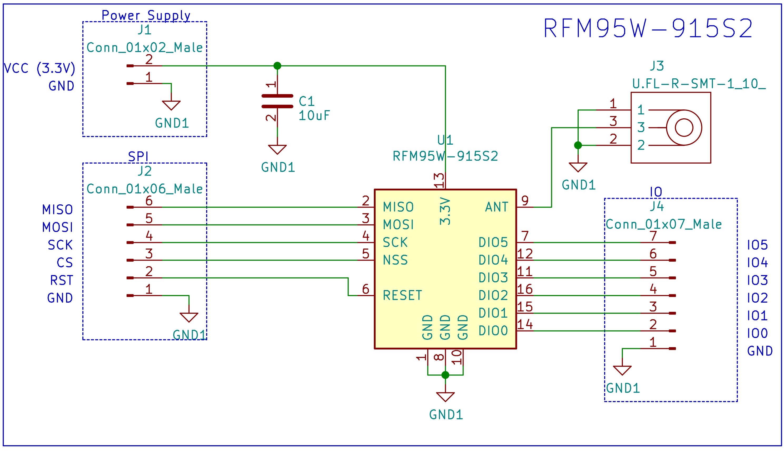
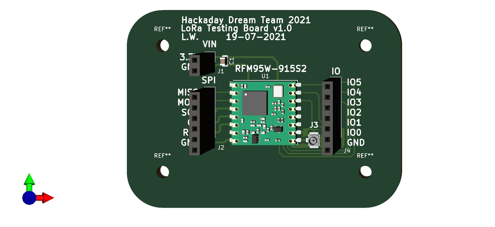
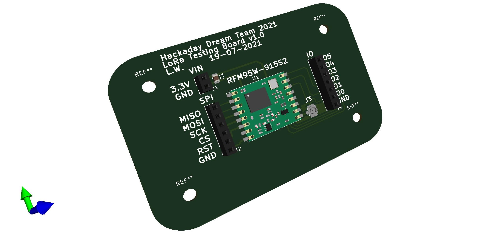

# RFM95W-915S2 Development Board #

This repository contains the design of a development board for the RFM95W-915S2. The PCB was designed using KiCad.

## Schematic ##

  

## Bill of Materials ##

| Reference | Quantity |
| ------------- | ------------- |
| [RFM95W-915S2 LoRa™ Transceiver Module 915MHz SMD](https://www.digikey.com/en/products/detail/rf-solutions/RFM95W-915S2/6564923)  | 1 |
| [10 µF ±10% 6.3V Ceramic Capacitor 0805](https://www.digikey.com/en/products/detail/samsung-electro-mechanics/CL21A106KQCLNNC/3888062)  | 1 |
| [U.FL (UMCC) Connector Receptacle, Male Pin 50 Ohm SMD](https://www.digikey.com/en/products/detail/hirose-electric-co-ltd/U-FL-R-SMT-1-10/2391570) | 1 |
| [Conn Header 40POS 2.54](https://www.digikey.com/en/products/detail/3m/2340-6111TG/1237275) | 1 |

## PCB ##

  

  

