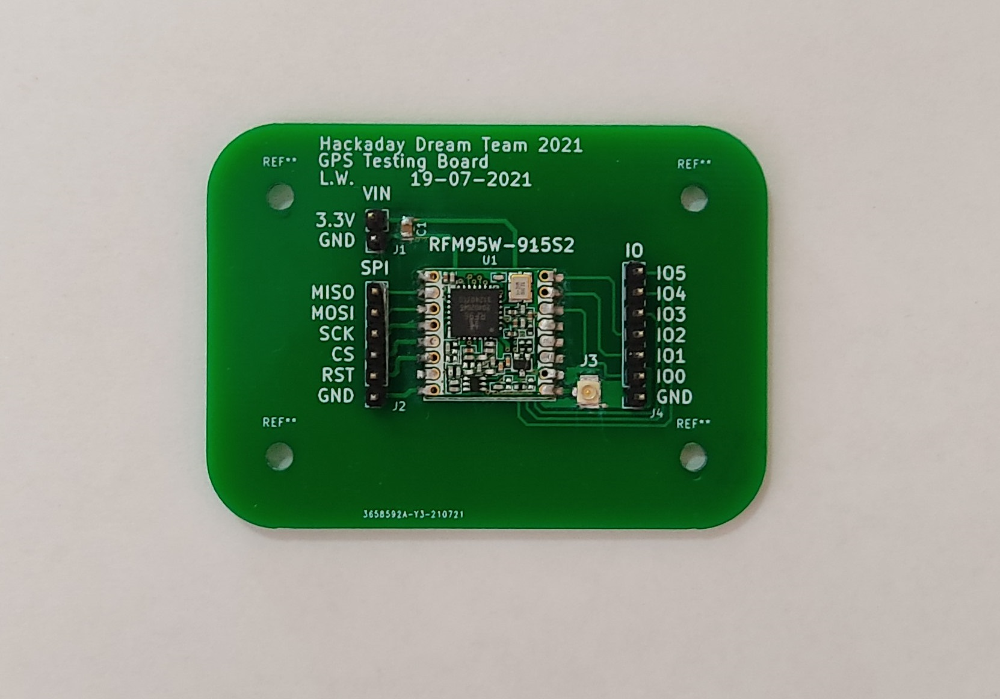
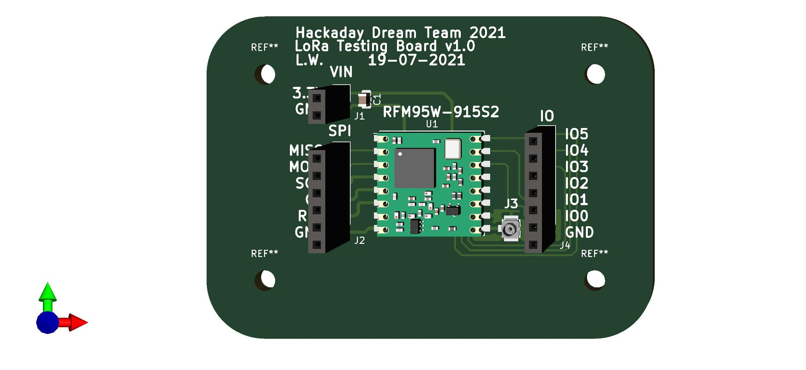
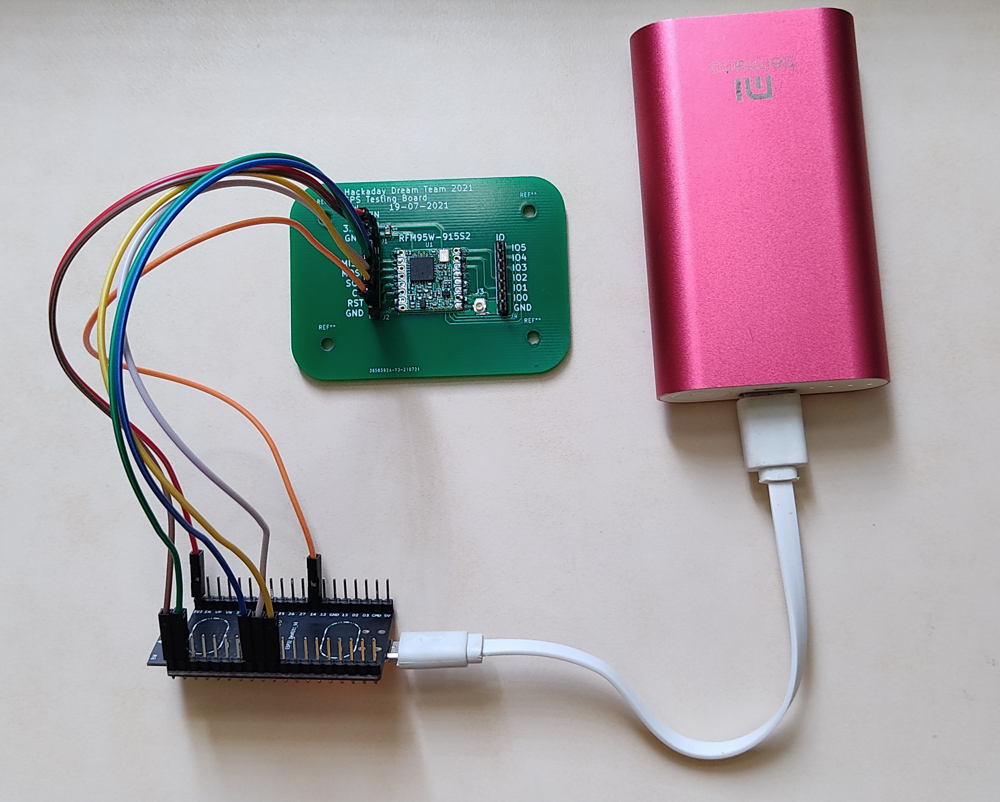
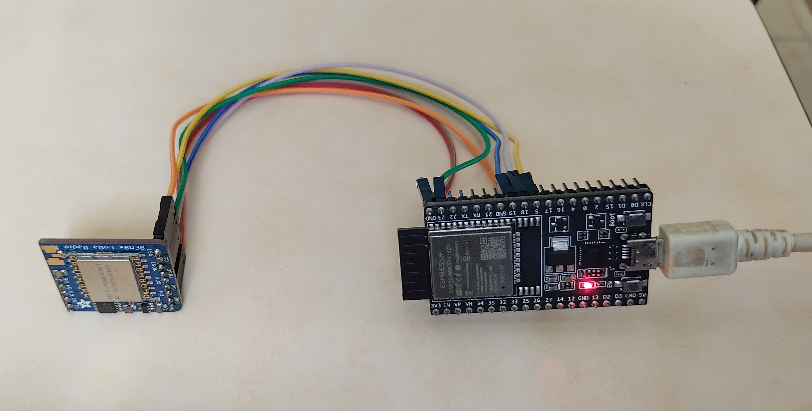
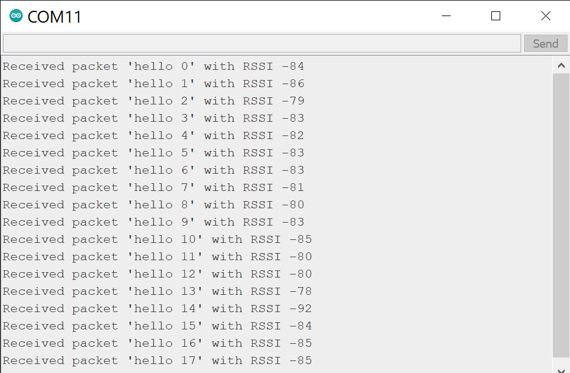

# RFM95W-915S2 Development Board #

  

This repository contains the design of a development board for the RFM95W-915S2. The PCB was designed using KiCad.

The [RFM95W-915S2 Development board](https://hackaday.io/project/173457/log/196116-lora-rfm95w-915s2-development-board) is a PCB that contains a RFM95W LoRa transceiver, a [U.FL connector](https://www.digikey.com/en/products/detail/hirose-electric-co-ltd/U-FL-R-SMT-1-10/2391570) for the external antenna, a decoupling capacitor and a group of headers connected to the different pins of the transceiver. The transceiver can be used as a sender or a receiver.

## Table of Contents

1. [Schematic](#schematic)
2. [Bill of Materials](#bill-of-materials)
3. [3D Model](#3d-model)
4. [Firmware and Testing](#firmware-and-testing)
5. [Authors](#authors)

## Schematic ##

  

**[Back to top](#table-of-contents)**

## Bill of Materials ##

| Reference | Quantity |
| ------------- | ------------- |
| [RFM95W-915S2 LoRa™ Transceiver Module 915MHz SMD](https://www.digikey.com/en/products/detail/rf-solutions/RFM95W-915S2/6564923)  | 1 |
| [10 µF ±10% 6.3V Ceramic Capacitor 0805](https://www.digikey.com/en/products/detail/samsung-electro-mechanics/CL21A106KQCLNNC/3888062)  | 1 |
| [U.FL (UMCC) Connector Receptacle, Male Pin 50 Ohm SMD](https://www.digikey.com/en/products/detail/hirose-electric-co-ltd/U-FL-R-SMT-1-10/2391570) | 1 |
| [Conn Header 40POS 2.54](https://www.digikey.com/en/products/detail/3m/2340-6111TG/1237275) | 1 |

**[Back to top](#table-of-contents)**

## 3D Model ##

  

  

**[Back to top](#table-of-contents)**

## Firmware and Testing ##

The webpage randomnerdtutorials.com has an amazing tutorial named [ESP32 with LoRa using Arduino IDE – Getting Started](https://randomnerdtutorials.com/esp32-lora-rfm95-transceiver-arduino-ide/), that tutorial contains detailed information about how to use the RFM95 with an ESP32 (the same microcontroller that was selected for our designs). I used the same firmware and connections provided by the tutorial.

The test requires 2 transceivers, one of them will be used as a sender and the other as a receiver. In this case, one of the transceivers is the  RFM95W-915S2 Development board and the other one is the [RFM95W transceiver from Adafruit](https://www.digikey.com/en/products/detail/adafruit-industries-llc/3072/6005357).

The connections are the following:

| ESP32 | RFM95W-915S2 Development Board |
| ------------- | ------------- |
| 3V3  | 3.3V |
| GND  | GND |
| GPIO 14  | RST |
| GPIO 5  | CS |
| GPIO 18  | SCK |
| GPIO 23  | MOSI |
| GPIO 19  | 	MISO |

  

| ESP32 | RFM95W Board from Adafruit |
| ------------- | ------------- |
| 3V3  | VIN |
| GND  | GND |
| GPIO 14  | RST |
| GPIO 5  | CS |
| GPIO 18  | SCK |
| GPIO 23  | MOSI |
| GPIO 19  | 	MISO |

  

This repository contains a folder named /Firmware/ that contains the project for the transceiver as a [receiver](https://github.com/leonardoward/lora-development-boards/blob/main/Firmware/esp32_RFM95_receiver/esp32_RFM95_receiver.ino) and a [sender](https://github.com/leonardoward/lora-development-boards/blob/main/Firmware/esp32_RFM95_sender/esp32_RFM95_sender.ino).  

Both of the RFM95W Boards were used as a sender and receiver, the result was successful in both cases. During the test, one of the transceivers sends the package "hello counter", where the counter is a number that goes from 0 to 32767. The other transceiver receives the package and prints the message through serial.

### Requisites ###

1. [ESP32 Add-on in Arduino IDE](https://randomnerdtutorials.com/installing-the-esp32-board-in-arduino-ide-windows-instructions/)
2. [LoRa Library](https://randomnerdtutorials.com/esp32-lora-rfm95-transceiver-arduino-ide/)

Results visualized in the serial monitor from the receiver circuit:

  

For more information about the firmware visit the [original tutorial for the RFM95W](https://randomnerdtutorials.com/esp32-lora-rfm95-transceiver-arduino-ide/).

**[Back to top](#table-of-contents)**

## Authors ##

* **[Leonardo Ward](https://github.com/leonardoward)**

**[Back to top](#table-of-contents)**
